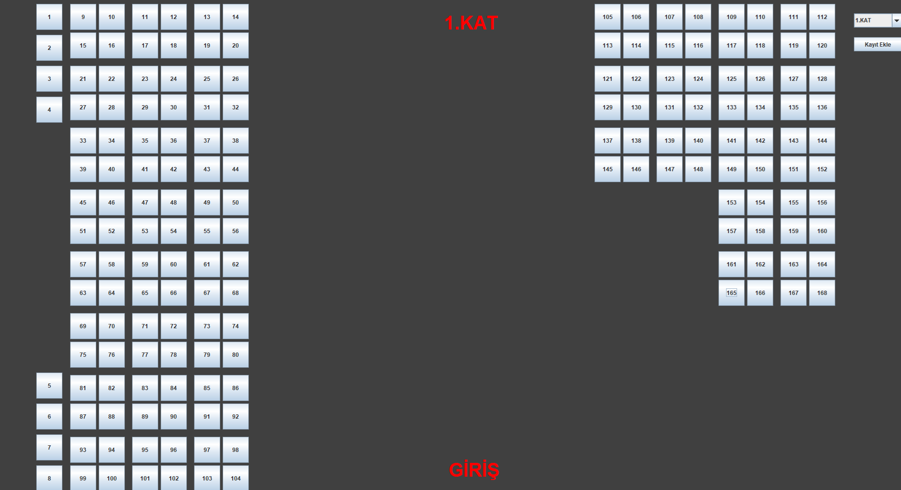
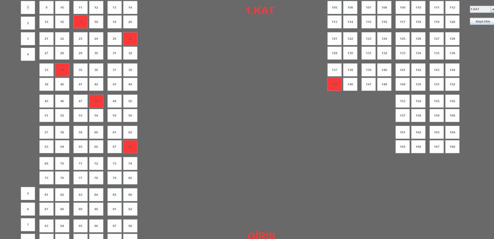
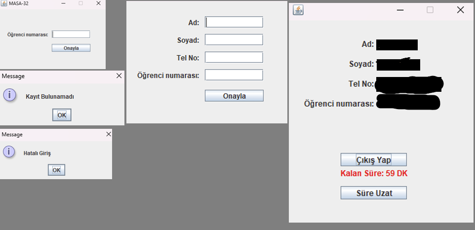

# Library-Management-System

Java Swing ile geliştirilmiş bir masaüstü uygulamasıdır.  
Bu proje, kütüphane içerisindeki çalışma masalarının doluluk durumlarını takip etmek için tasarlanmıştır.  

---

### 📖 Proje Hakkında  
Uygulama, kullanıcıların kütüphanedeki oturma alanlarını görüntülemesini, dolu veya boş masa durumlarını takip etmesini sağlar.  
Kütüphane yönetimi, masa bilgilerini sistem üzerinden güncelleyebilir.

---

### 🧩 Özellikler
- Çalışma masalarının doluluk durumunu görüntüleme  
- Masa ekleme, silme ve güncelleme  
- Swing tabanlı kullanıcı arayüzü  
- Gerçek zamanlı durum takibi  

---

### 🛠️ Kullanılan Teknolojiler
- **Java (Swing)**  
- **Object-Oriented Programming (OOP)**  

---

### 🖼️ Ekran Görüntüleri

### 👥 Ekip Üyeleri

